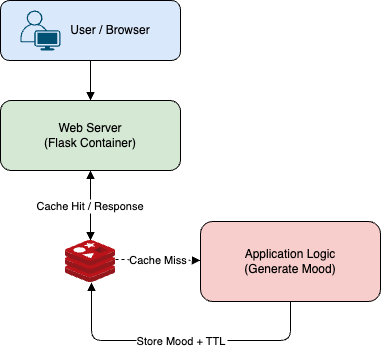

# 🐳 Baisic Docker

This repository demonstrates **basic Docker concepts**, **multi-container communication using Docker Compose**, and a **simple Flask + Redis application** that serves a **Mood of the Day** with a GIF.

It is designed as a **learning repository** for understanding Docker fundamentals, container lifecycle, image building, Docker Hub usage, and Docker Compose orchestration.

---

## 📌 What This Repo Covers

* ✅ Basic Docker commands (build, run, stop, remove, push)
* ✅ Dockerfile best practices
* ✅ Multi-container setup using Docker Compose
* ✅ Flask application container
* ✅ Redis cache container
* ✅ Container-to-container communication
* ✅ Cache invalidation & TTL concepts

---

## 🧱 Architecture Overview



* Flask generates a **Mood of the Day**
* Redis caches the mood for the current day
* All containers communicate over the Docker Compose network

---

## 📁 Structure

```
.
├── app.py                 # Flask application
├── requirements.txt       # Python dependencies
├── Dockerfile             # App image definition
├── docker-compose.yml     # Multi-container orchestration
├── templates/
│   └── index.html         # UI template
├── docker-basics.sh       # Basic Docker commands reference
└── README.md
```

---

## 🚀 Application: Mood of the Day

### Features


* Random mood generation
* Same mood served all day (cached in Redis)
* Automatically refreshes next day

### Run using Docker Compose

```bash
docker compose up --build
```

Open in browser:

```
http://localhost:8080
```

---

## 🔄 Cache Refresh Options

* Restart Redis container
* Manually delete Redis key
* Use application refresh endpoint (if enabled)

Example:

```bash
docker exec -it mood-redis redis-cli
DEL mood:YYYY-MM-DD
```

---

## 🐳 Docker Basics Script

The file `docker-basics.sh` contains commonly used Docker commands for **learning and quick reference**.

### Covered Commands

```bash
# Check Docker version
docker --version

# Test Docker installation
docker run hello-world

# Pull images from Docker Hub
docker pull alpine

# Pull and run a container
docker container run centos:7 echo 'Hello World!'

# Run a container in detached mode
docker container run -di alpine

# Stop all running containers
docker stop $(docker ps -q)

# Remove exited containers
docker rm $(docker ps -a -q -f status=exited)

# Remove all images
docker rmi $(docker images -q)

# Build Docker image
docker build -t pranaychowdary4/mood-of-the-day .

# Push image to Docker Hub
docker push pranaychowdary4/mood-of-the-day

# Run container from Docker Hub image
docker run -di -p 5000:5000 pranaychowdary4/mood-of-the-day

# Deploy app using Docker Compose
docker compose up --build

# List Docker networks
docker network ls

# Inspect Docker Compose network
docker network inspect dasic_default

# Stop containers and remove volumes
docker compose down -v
```

---

## 🧠 Key Docker Concepts Demonstrated

| Concept    | Explanation                    |
| ---------- | ------------------------------ |
| Image      | Immutable application template |
| Container  | Running instance of an image   |
| Dockerfile | Image build instructions       |
| Docker Hub | Image registry                 |
| Compose    | Multi-container orchestration  |
| Redis      | External cache service         |
| Networking | Service name based DNS         |

---

## 📈 Possible Enhancements

### 🐳 Docker Improvements
* Replace Flask dev server with Gunicorn/Uvicorn
* Add HEALTHCHECK to Dockerfile
* Add .dockerignore to reduce image size
* Add resource limits in Compose
* Enable Redis persistence (AOF/RDB + volumes)\
* Externalize configuration via environment variables

### 🧩 Docker Compose Enhancements
* Scale app containers (--scale app=3)
* Add Redis volume for durability
* Add logging drivers (json-file / loki)
* Separate frontend and backend networks

### ☸️ Kubernetes Enhancements
* Convert app to Deployment + Service
* Use ConfigMaps for configuration
* Use Secrets for sensitive values
* Add Redis as StatefulSet
* Add readiness & liveness probes
* Add Horizontal Pod Autoscaler (HPA)
* Use Ingress for traffic routing

### 🔄 CI/CD Enhancements
* GitHub Actions pipeline
* Lint & test on pull request
* Build & scan Docker images
* Push image to Docker Hub automatically
* Deploy to Kubernetes using GitOps (ArgoCD / Flux)

### 🔍 Observability Enhancements
* Add Prometheus metrics endpoint
* Centralized logging (ELK / Loki)
* Application monitoring (Grafana)
* Alerting on failures

---

## 🏁 Final Note

This repository intentionally starts **simple** and focuses on core Docker and Docker Compose concepts..

While building this one, certain Docker-specific limitations (daemon behavior, storage drivers, networking constraints, and security considerations) became apparent and are addressed in more depth in a separate [Docker-focused repository](https://github.com/PranayChowdary48/Docker/).

Happy containerizing 🚀
